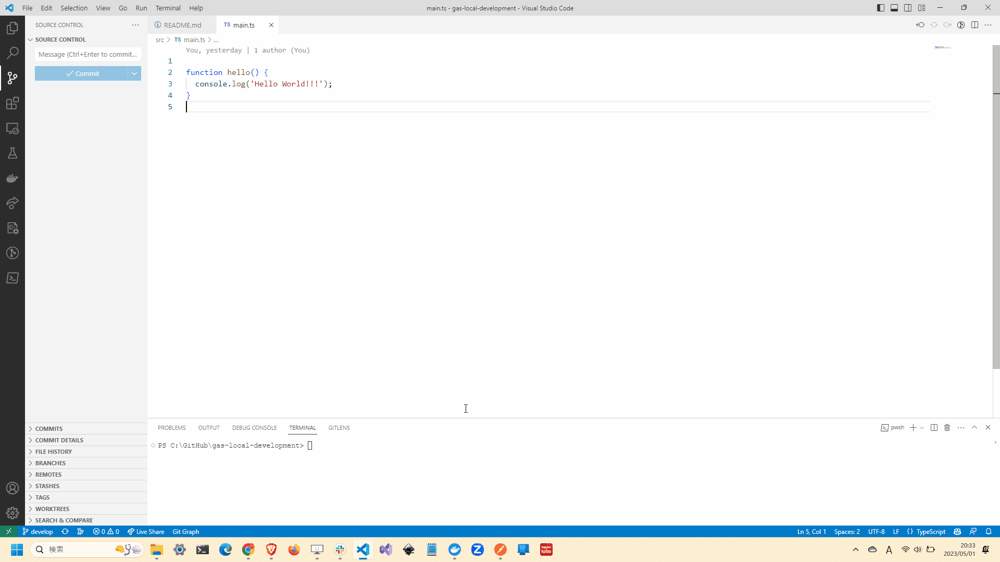

# gas-local-development

🍍🍍🍍 Claspを使用して`Google Apps Script`のローカル開発環境を構築するサンプル。  

  

## 環境構築

最初に<https://script.google.com/home/usersettings>にアクセスして、`Google Apps Script API`を有効にします。  

次にClaspをインストールします。  

```shell
yarn global add @google/clasp
```

Claspにログインします。  

```shell
clasp login
```

認証情報が`~/.clasprc.json`に保存されます。  
これをコピーして、GitHub ActionsのSecretsに`CLASPRC_JSON`という名前で保存します。  

## コマンドの説明

| コマンド | 説明 |
| --- | --- |
| `clasp push` | ローカルのファイルをGoogle Apps Scriptにアップロードします。 |
| `clasp pull` | Google Apps Scriptのファイルをローカルにダウンロードします。 |
| `clasp open` | Google Apps ScriptのウェブIDEを開きます。 |
| `clasp create` | Google Apps Scriptのプロジェクトを作成します。 |

## 参考文献

- <https://recruit.gmo.jp/engineer/jisedai/blog/google_apps_script_local_dev/>
